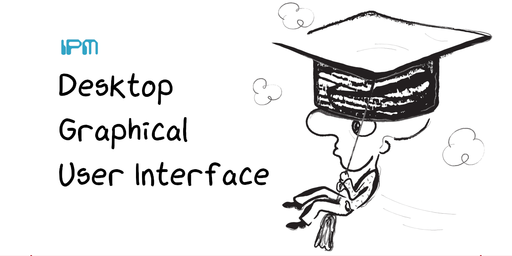

# Curso 22/23. Práctica 1. Interfaces gráficas para aplicaciones de escritorio

_Repositorio dedicado al desarrollo de la primera práctica de equipo
de IPM_

La práctica consiste en el desarrollo de una aplicación con una
_interface gráfica de escritorio_. La aplicación tiene _un caso de
uso_:
   
   - Buscar en cheat.sh
   
     > La usuaria indica de alguna manera qué información quiere
     > consultar en `cheat.sh`. La aplicación realiza la/s petición/es
     > necesaria/s al servidor y muestra el resultado a la usuaria.
	 

## Contributors:

- González Trillo, Cristian : cristiantrillo : cristian.gonzalez.trillo@udc.es
- Cidrás Fernández, Clara : claracidras : clara.cidras@udc.es
- Amestoy López, José Manuel : manuamest : manuel.amestoy@udc.es

## Welcome :wave:

- **Who is this for**: Grupos de prácticas de la asignatura _IPM_.

- **What you'll learn**: Patrones arquitectónicos para interfaces
  gráficas, uso y necesidad de la concurrencia en interfaces
  gráficias, internacionalización de intefaces gráficas.

- **What you'll build**: Construireis una aplicación con una interface
  gráfica de escritorio.

- **Prerequisites**: Asumimos que os resultan familiares el lenguaje de
  programación _python_ y la librería _Gtk+_.

- **How long**: Este assigment está formado por tres pasos o
  _tareas_. La duración estimada de cada tarea es de una semana
  lectiva.

## Pasos para comenzar el assignment:

1. Cubrir la lista _Contributors_ siguiendo el formato dado.

2. Seleccionar un diseño o una mezcla de los diseños que tenéis
   disponibles de la práctica individual. Adaptar el diseño según sea
   necesario y añadir el diseño a este repositorio en un fichero _PDF_
   con el nombre `diseño-iu.pdf`

<h2>Tarea 1: Diseño software e implementación</h2>

### :wrench: Esta tarea tiene las siguientes partes:

  1. Seleccionar un patrón arquitectónico que separe los componentes
     _vista_ y _estado/modelo_.
	 
  2. Realizar un diseño software siguiendo el patrón seleccionado.
  
	  - El diseño tiene que cubir el caso de uso de la aplicación.
	  
	  - El diseño se realiza según el lenguaje _UML_ y debe incluir
        diagramas tanto para la parte estática como para la dinámica.
		
	  - La documentación del diseño se incorpora al fichero
        `diseño_sw.md` de este repositorio. El formato del fichero es
        la versión de _markdown_ [Github Flavored Markdown](https://docs.github.com/es/get-started/writing-on-github/getting-started-with-writing-and-formatting-on-github/basic-writing-and-formatting-syntax). Los
        diagramas UML se integran directamente en el fichero markdow
        usando [_Mermaid_](https://github.blog/2022-02-14-include-diagrams-markdown-files-mermaid/)
		
  3. Implementar la aplicación siguiendo el diseño de la interface y
     el diseño software creados anteriormente.
	 
	   - El lenguaje de programación es python.
	   
	   - La librería gráfica es GTK verión 3 ó 4.
	   
	   - La estructura de módulos debe facilitar en lo posible el
         seguimiento del diseño sw. Se recomienda que, al menos, los
         componentes _vista_ y _estado/modelo_ esten en módulos o
         paquetes separados.
	   

### :books: Objetivos de aprendizaje:

  - Patrones arquitectónicos en IGUs.
  
  - Uso de librerías para construir IGUs.
  
  - Progamación dirigida por eventos

> **Note** En este repositorio se incluye un módulo python que muestra
> cómo acceder al servidor `cheat.sh` y analizar sus respuestas.

<h2>Tarea 2: Gestión de la concurrencia y la E/S en IGUs</h2>

### :wrench: Esta tarea tiene las siguientes partes:

  1. Identificar las operaciones que pueden resultar erroneas y
     modificar la aplicación para gestionar esos errores e informar a
     la usuaria.
	 
	 > **TIP:** Son las peticiones al servidor.
	 
  2. Identificar las operaciones de E/S que pueden bloquear la
     interface e implementar una gestión concurrente de las mismas.
	 
	 > **TIP:** Siguen siendo las peticiones al servidor.
	 
> :warning: Estos cambios en la implementación deben ir acompañados
> del cambio correspondiente en el diseño sw y también podría ser
> necesario un cambio en el diseño de la interface gráfica de usuaria
> (_IGU_).

### :books: Objetivos de aprendizaje:

  - Naturaleza concurrente de las interfaces.
  
  - Uso de la concurrencia.
  
  - Gestión de errores en la E/S.
  

<h2>Tarea 3: Internacionalización</h2>

### :wrench: Esta tarea tiene las siguientes partes:

  1. Internacionalizar la aplicación para que se adapte a la
     configuración del _locale_ de la usuaria.
	 
  2. Para demostrar la validez de la implementación, localizar la
     interface a un idioma distinto del original.
	 
### :books: Objetivos de aprendizaje:

  - Internacionalización de IGUs.

<h2>Finish</h2>

_Congratulations friend, you've completed this assignment!_

Una vez terminada la práctica no olvideis revisar el contenido del
repositorio en Github y comprobar su correcto funcionamiento antes de
realizar la defensa.

