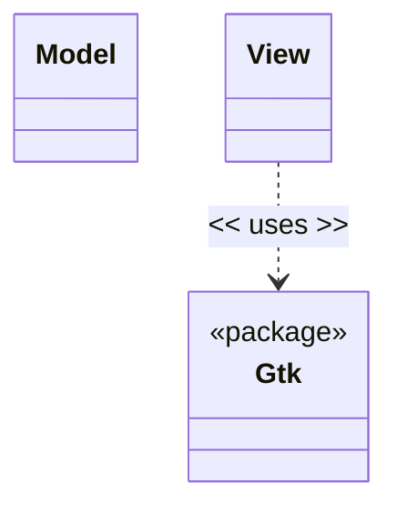
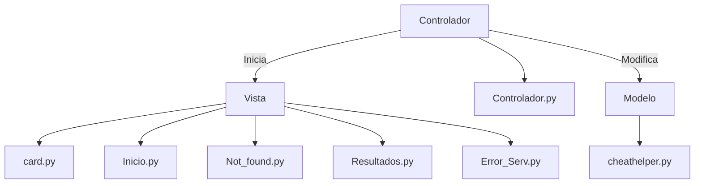
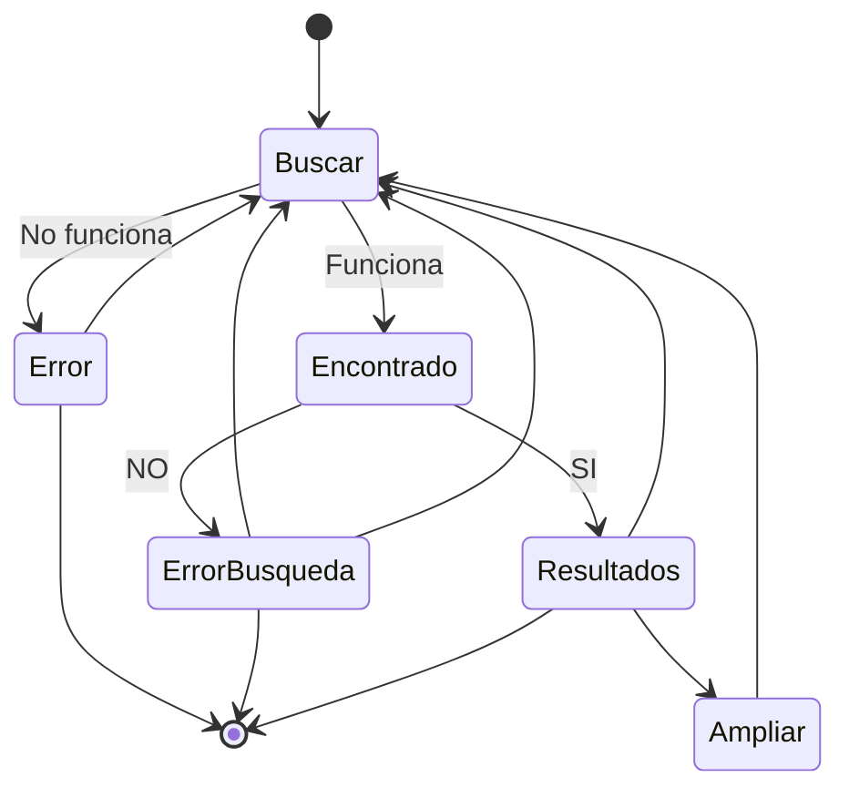

# Diseño software

<!-- ## Notas para el desarrollo de este documento
En este fichero debeis documentar el diseño software de la práctica.

> :warning: El diseño en un elemento "vivo". No olvideis actualizarlo
> a medida que cambia durante la realización de la práctica.

> :warning: Recordad que el diseño debe separar _vista_ y
> _estado/modelo_.
	 

El lenguaje de modelado es UML y debeis usar Mermaid para incluir los
diagramas dentro de este documento. Por ejemplo:

-->
## Patrón
Para la creación de esta aplicación hemos escogido el **patrón MVC**, este patrón convierte el desarrollo de aplicaciones complejas en un proceso mucho más manejable. Permite a varios desarrolladores trabajar simultáneamente en la aplicación.
 Este patrón se basa en la división del desarrollo en tres partes:
- **Modelo:** Es el backend, contiene toda la lógica de la aplicación, en nuestro caso es el *cheathelper.py*
- **Vista:** Es el frontend o la interfaz gráfica del usuario, comunica al usuario con la aplicación y cambia continuamente, en nuestro caso la vista se encuentra implementada en los ficheros *insertar nombre de ficheros*
- **Controlador:** Es el cerebro de la aplicación, comunica el modelo con la vista, se encarga de realizar las peticiones, lanzar los errores y cambiar las pantallas, nuestro fichero controlador es *insertar nombre de fichero*

## Clases

> cheathelper.py
 
 modelo de la aplicacion, establece conexion con la web cheat.sh para recibir la informacion de los comandos, proporcionado en el enunciado
 
> controlador.py

 controlador de la aplicacion, conecta interfaz y modelo, permitiendo realizar consultas a nuestra aplicacion desde una interfaz
 
> Inicio.py, Error_Serv.py, Not_Found.py, Resultados.py, card.py
 
  ficheros con la interfaz de la aplicación, juntos forman la vista, implementados en python usando GTK
  
> diseño-iu.pdf

 fichero con la interfaz estática de la aplicación, croquis inial de la misma

## Diseños UML
### Estructura del patron

### Diagrama de estados

