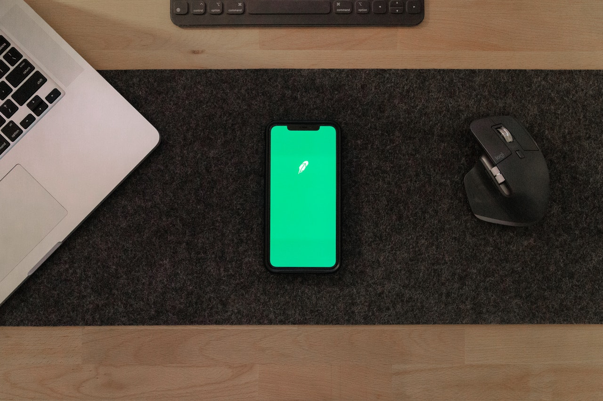

# Curso 22/23. Práctica 2. Interfaces gráficas para aplicaciones de dispositivos móviles

_Repositorio dedicado al desarrollo de la segunda práctica de equipo
de IPM_

La práctica consiste en el desarrollo de una aplicación para
dispositivos móviles. La aplicación consta de los siguientes _casos de
uso_:

  - Consultar recetas de cocina
 
    > La usuaria indica las recetas que desea consultar introduciendo
    > los siguientes datos: palabras clave y categorización. La
    > aplicación realiza una búsqueda en el servidor
    > [edaman](https://www.edamam.com/) y muestra la lista de recetas
    > que cumplen los criterios.
   
    > :note: Las distintas opciones de categorización son las que
    > ofrece la _api_ del servidor. Algunos ejemplos: tipo de
    > alimento, rango de calorías, tipo de cocina, etc.
   
  - Consultar una receta en detalle
 
    > La usuaria selecciona una receta concreta y la aplicación
    > muestra los detalles de esa receta.

> :warning: para poder usar el servicio, es necesario registrarse a
> través de su web y obtener los _tokens_ correspondiente.

## Contributors:

- González Trillo, Cristian : cristiantrillo : cristian.gonzalez.trillo@udc.es
- Cidrás Fernández, Clara : claracidras : clara.cidras@udc.es
- Amestoy López, José Manuel : manuamest : manuel.amestoy@udc.es

## Welcome :wave:

- **Who is this for**: Grupos de prácticas de la asignatura _IPM_.

- **What you'll learn**: Diseño de interfaces adaptativo, composición
  de Widgets, concurrencia con funciones asíncronas, testing
  end-to-end con interfaces gráficas.

- **What you'll build**: Construiréis una aplicación para dispositivos
  móviles.

- **Prerequisites**: Asumimos que os resultan familiares el lenguaje de
  programación _dart_ y la librería _flutter_.

- **How long**: Este assignment está formado por tres pasos o
  _tareas_. La duración estimada de cada tarea es de una semana
  lectiva.

## Pasos para comenzar el assignment:

1. Cubrir la lista _Contributors_ siguiendo el formato dado.

<h2>Tarea 1: Dos diseños: móvil y tablet</h2>

### :wrench: Esta tarea tiene las siguientes partes:

  1. Realizar el diseño de la interfaz para los casos de uso indicado.
  
	  - El diseño tiene que incluir diseños adaptados tanto para
        móviles como para tablets.
	  
	    * Al adaptar el diseño a los distintos dispositivos, al menos
          resultarán dos diseños distintos: móvil y tablet.
		  
	    * Cada diseño debe adaptarse realmente al dispositivo. No es
          suficiente, por ejemplo, que la versión de tablet sea una
          versión ampliada de la de móvil.

      - El diseño tiene que incluir los elementos necesarios para la
        gestión de errores, proporcionar la retroalimentación
        necesaria a la usuaria durante las operaciones de E/S, ...
	  
	  - Las pautas para documentar el diseño son las mismas que las
	    pautas de la primera fase de la práctica individual.
		
	  - La documentación del diseño se incorpora al fichero
        `diseño_iu.pdf` de este repositorio.

### :books: Objetivos de aprendizaje:

  - Diseño adaptativo.
  

<h2>Tarea 2: Implementación</h2>

### :wrench: Esta tarea tiene las siguientes partes:

  1. Implementar la aplicación siguiendo el diseño de la interfaz
     creado anteriormente.
	 
	   - El lenguaje de programación es dart
	   
	   - La librería gráfica es flutter.

     > :warning: No olvidéis en las operaciones de E/S de informar a la
	 > usuaria de todo lo necesario y gestionar los posibles errores.

	 > :warning: Actualmente flutter soporta múltiples plataformas:
	 > linux, web, android, ios, etc. Dado que el resultado de la
	 > práctica es una aplicación móvil, tenéis que cercioraros de que
	 > la aplicación funciona como se espera en android o/y ios. La
	 > defensa de la práctica también se realizará ejecutando la
	 > aplicación en alguna de dichas plataformas.

	 > :warning: Los cambios en la implementación deben ir acompañados
	 > del cambio correspondiente en el diseño sw y también podría ser
	 > necesario un cambio en el diseño de la interfaz gráfica de
	 > usuaria (_IGU_). En ambos casos, los commits correspondientes
	 > debe incluir las modificaciones de dichos diseños.

	 > **Note** Tanto para el desarrollo como para la presentación de
	 > la aplicación podéis usar un emulador y/o un dispositivo
	 > real. En caso de usar un dispositivo real, os resultará muy
	 > útil una aplicación como
	 > [scrcpy](https://github.com/Genymobile/scrcpy)

	 > **Note** En este repositorio se incluye un fichero
	 > `edaman.dart`. El fichero contiene el código para una
	 > aplicación _CLI_ que realiza consultas al servidor
	 > _edaman_. Podéis usar el código como consideréis conveniente
	 > para el desarrollo de la práctica.

### :books: Objetivos de aprendizaje:

  - Composición de widgets.
  
  - Patrones de manejo de estado no-MVC.
  

<h2>Tarea 3: Test end2end</h2>

### :wrench: Esta tarea tiene las siguientes partes:

  1. Implementar los tests _end to end_ para los distintos casos de la
     aplicación.

     - Los tests también deben cubrir los errores de E/S.

### :books: Objetivos de aprendizaje:

  - Tests end to end con interfaces gráficas.

<h2>Finish</h2>

_Congratulations friend, you've completed this assignment!_

Una vez terminada la práctica no olvidéis revisar el contenido del
repositorio en Github y comprobar su correcto funcionamiento antes de
realizar la defensa.

